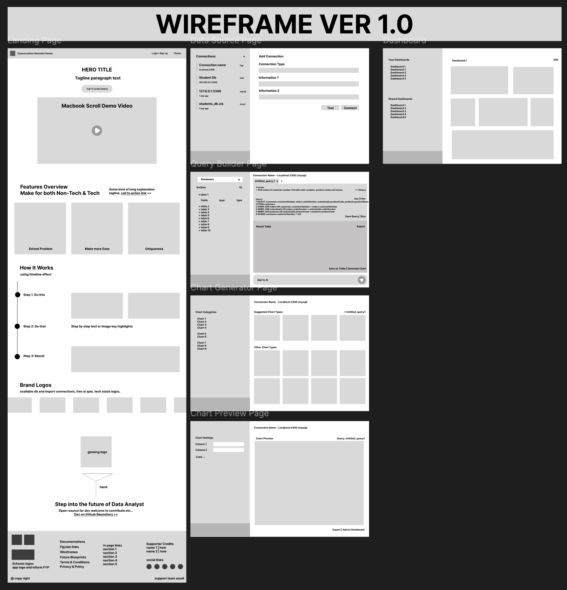
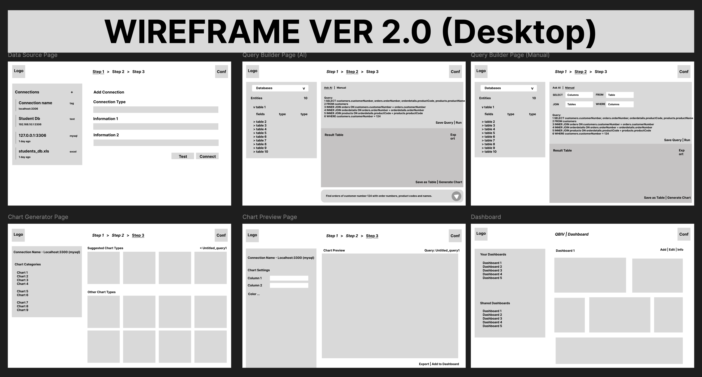
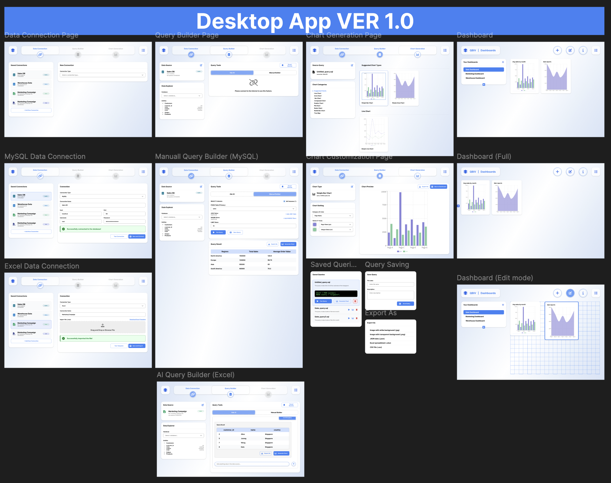
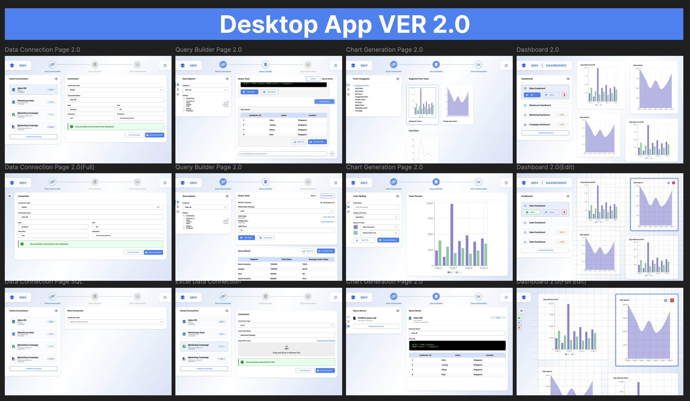
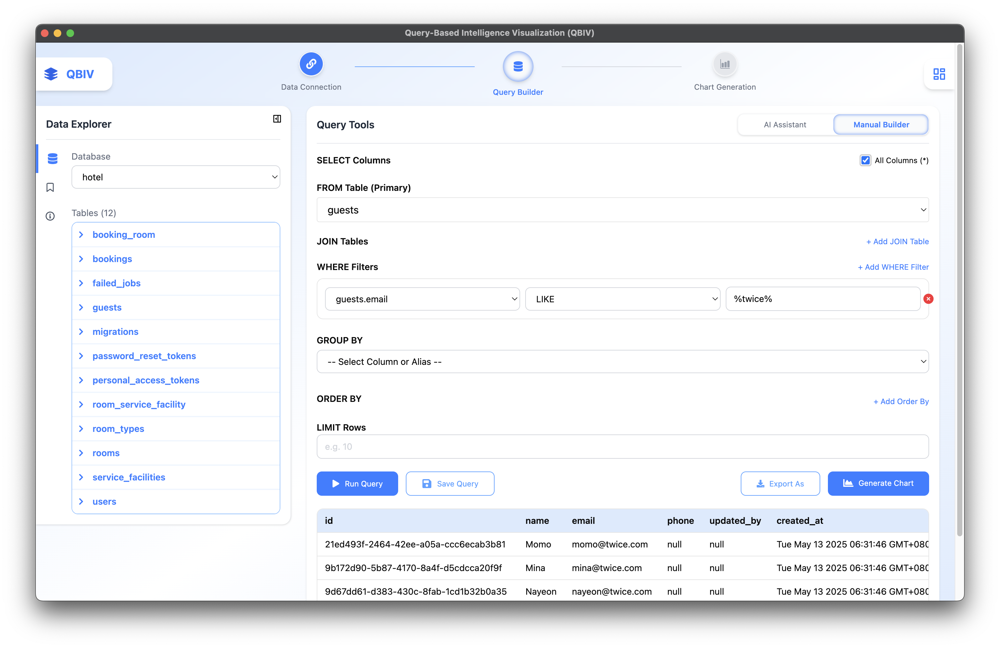
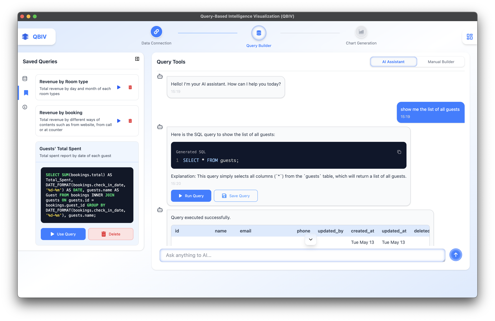
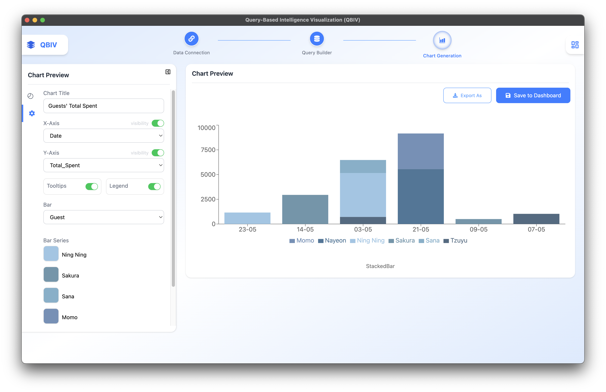
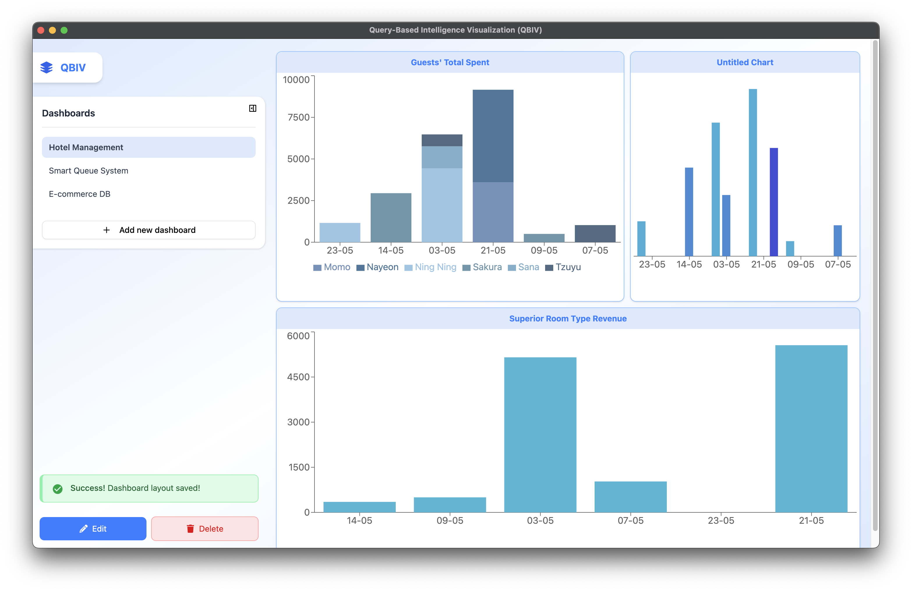

# QBIV – Query-Based Intelligence Visualization

**AI-Powered SQL Visualizer for Everyone**

  


**Version**: Alpha v1.0.0

---

## 🧠 Overview

**QBIV** is a cross-platform business intelligence (BI) desktop app built for non-technical users and small teams. It enables users to query structured data from databases or files using **natural language** or **form-based SQL**, then visualize the results in rich, interactive charts and dashboards.

---

## 🚀 Features

- 🔌 **Connect to MySQL / Import CSV & Excel**
- 🤖 **AI Query Builder**: Natural language to SQL
- 🧱 **Form-Based SQL Builder**: Drag-and-drop simplicity
- 📊 **Chart Generator**: Bar, line, area, and dual-axis charts
- 📋 **Dashboard System**: Save, arrange, and share charts
- 🔒 **Offline-First**: Full functionality without internet
- 🌐 **Cross-Platform**: Runs on **Windows**, **macOS**, and **Linux**

---

## 📷 UI/UX Prototype

### 🎯 Wireframe (Figma)
<div style="display: flex; gap: 10px;"> <div style="flex: 1; text-align: center;"> </div> <div style="flex: 1; text-align: center;">  </div> </div>

### 🧪 Interactive Prototype
<div style="display: flex; gap: 10px;"> <div style="flex: 1; text-align: center;">  </div> <div style="flex: 1; text-align: center;"> </div> </div> <p><a href="https://www.figma.com/proto/iN0IdDQdUBO1ZIUyVAYGRE/Software-projects?node-id=599-2070&p=f&t=3tZWQbTTcjb3Qjcf-0&scaling=scale-down&content-scaling=fixed&page-id=474%3A841&starting-point-node-id=599%3A2070&show-proto-sidebar=1"><strong>🔗 View Prototype on Figma</strong></a></p>

### 🖥️ App Interface – Final Outcome Preview
| Manual Query Builder | AI Query Builder |
|----------------------|------------------|
|  |  |

| Chart Configuration | Dashboard View |
|---------------------|----------------|
|  |  |


---

## 🔗 Links

- 🌍 **Landing Website**: [qbiv.netlify.app](https://qbiv.netlify.app)
- 📥 **Download QBIV (v1.0.0 Alpha)**:
  - [⬇️ Windows (.exe)](https://example.com/qbiv-win.exe)
  - [⬇️ macOS (.dmg)](https://example.com/qbiv-mac.dmg)
  - [⬇️ Linux (.AppImage)](https://example.com/qbiv-linux.AppImage)

---

## 🛠️ Tech Stack

| Layer     | Tech                          |
|-----------|-------------------------------|
| Frontend  | React + Tailwind CSS          |
| Backend   | Electron + SQLite             |
| Language  | TypeScript                    |
| Charting  | Recharts                      |
| AI Query  | OpenAI / NLP-to-SQL API       |
| Build     | Vite                          |
| Tools     | Figma, GitHub, Canva, Netlify |

---

## 📦 Installation (Development Mode)

```bash
# Clone the repo
git clone https://github.com/sai-zack-dev/query-based-intelligence-visualization.git

cd query-based-intelligence-visualization

# Install dependencies
npm install

# Start the Electron app
npm run dev
````

Make sure you have:

* Node.js ≥ 18
* npm ≥ 9

---

## 🌱 Future Plans

* 🌐 Web app version (Laravel + React)
* 📱 Mobile app for viewing dashboards (React Native + Expo)
* ☁️ Cloud sync for dashboards & team collaboration
* 🔐 Role-based sharing & multi-user workspaces
* 🌍 Multi-language UI support
* 🧠 Fine-tuned AI for better schema-based query generation

---
## 📋 Poster and Slides


**Presentation Slides**: [canva.qbiv](https://www.canva.com/design/DAGuhi0refg/RlUnOanhwOrlcLiARaEslw/view?utm_content=DAGuhi0refg&utm_campaign=designshare&utm_medium=link2&utm_source=uniquelinks&utlId=h031efc99a6%27#1)

---

## 👨‍💻 Author / Developer

**Sai Zay Linn Htet**
BSc (Hons) Cybersecurity and Networks
Teesside University @ MDIS Singapore

* 🌐 Portfolio: [sai-zack.dev](https://saiz-portfolio.netlify.app/)
* 🐙 GitHub: [@sai-zack](https://github.com/sai-zack-dev)
* 📧 Email: [saizaylin.nhtet@example.com](mailto:saizlinh@gmail.com)
