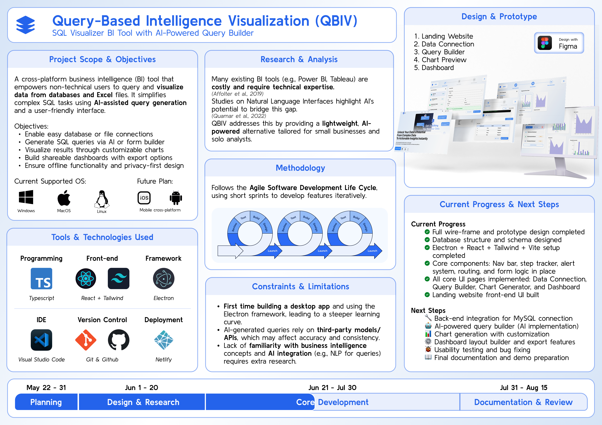

# QBIV – Query-Based Intelligence Visualization

**AI-Powered SQL Visualizer for Everyone**

  


**Version**: Alpha v1.0.0

---

## 🧠 Overview

**QBIV** is a cross-platform business intelligence (BI) desktop app built for non-technical users and small teams. It enables users to query structured data from databases using **natural language** or **form-based SQL**, then visualize the results in rich, interactive charts and dashboards.

---

## 🚀 Features

- 🔌 **Easy connect to MySQL database**
- 🤖 **AI Query Builder**: Natural language to SQL
- 🧱 **Form-Based SQL Builder**: Build SQL queries using interactive form controls (checkboxes, dropdowns, inputs) — no need to write code  
- 📊 **Chart Generator**: Bar, line, area, and pie charts
- 📋 **Dashboard System**: Save, arrange, and share charts
- 🔒 **Offline-First**: Works offline for almost all features (only the AI-powered SQL generation requires internet)
- 🌐 **Cross-Platform**: Runs on **Windows**, **macOS**, and **Linux**

---

## 📷 UI/UX Prototype

### 🎯 Wireframe (Figma)
<div style="display: flex; gap: 10px;"> <div style="flex: 1; text-align: center;"> </div> <div style="flex: 1; text-align: center;">  </div> </div>

### 🧪 Interactive Prototype
<div style="display: flex; gap: 10px;"> <div style="flex: 1; text-align: center;">  </div> <div style="flex: 1; text-align: center;"> </div> </div> <p><a href="https://www.figma.com/proto/iN0IdDQdUBO1ZIUyVAYGRE/Software-projects?node-id=599-2070&p=f&t=3tZWQbTTcjb3Qjcf-0&scaling=scale-down&content-scaling=fixed&page-id=474%3A841&starting-point-node-id=599%3A2070&show-proto-sidebar=1"><strong>🔗 View Prototype on Figma</strong></a></p>

### 🖥️ App Interface – Final Outcome Preview
| Manual Query Builder | AI Query Builder |
|----------------------|------------------|
|  |  |

| Chart Configuration | Dashboard View |
|---------------------|----------------|
|  |  |


---

## 🔗 Links

- 🌍 **Landing Website**: [qbiv.netlify.app](https://qbiv.netlify.app)

**Latest version:** [v1.0.0](https://github.com/sai-zack-dev/query-based-intelligence-visualization/releases/tag/v1.0.0)

| Platform | Installer | 
|----------|-----------|
| 🪟 Windows | [Download .exe](https://github.com/sai-zack-dev/query-based-intelligence-visualization/releases/latest/download/QBIV.Setup.1.0.0.exe) |
| 🍎 macOS (M1/M2) | [Download .dmg](https://github.com/sai-zack-dev/query-based-intelligence-visualization/releases/latest/download/QBIV-1.0.0-arm64.dmg) |
| 🐧 Linux (AppImage) | [Download .AppImage](https://github.com/sai-zack-dev/query-based-intelligence-visualization/releases/latest/download/QBIV-1.0.0.AppImage) |
| 🐧 Linux (Debian) | [Download .deb](https://github.com/sai-zack-dev/query-based-intelligence-visualization/releases/latest/download/qbiv_1.0.0_amd64.deb) |

---

## 🛠️ Tech Stack

| Layer     | Tech                          |
|-----------|-------------------------------|
| Frontend  | React + Tailwind CSS          |
| Backend   | Electron + SQLite             |
| Language  | TypeScript                    |
| Charting  | Recharts                      |
| AI Query  | OpenAI / NLP-to-SQL API       |
| Build     | Vite                          |
| Tools     | Figma, GitHub, Canva, Netlify |

---

## ✅ Full Setup Guide for QBIV (Main App + AI Proxy)

### 1. **Clone and Set Up the AI Proxy First**

The AI proxy acts as a local server that converts natural language prompts to SQL via Groq API.

```bash
# Clone the AI proxy repo
git clone https://github.com/sai-zack-dev/qbiv-ai-proxy.git

cd qbiv-ai-proxy

# Install dependencies
npm install

# Create .env file
cp .env.example .env
```

Then open `.env` and fill in:

```env
GROQ_API_KEY=your-real-api-key-here
```

> 🔑 **How to get a Groq API Key:**
>
> 1. Go to [https://console.groq.com/keys](https://console.groq.com/keys) (you need to sign in).
> 2. Click **“Create Key”**.
> 3. Copy the key and paste it into the `.env` file under `GROQ_API_KEY`.

### 2. **Run the AI Proxy Server**

After setting the key:

```bash
node index.js
```

This will start the proxy on **`http://localhost:3000`**.

### 3. **Clone and Set Up the Main QBIV App**

```bash
# In another terminal tab or window
git clone https://github.com/sai-zack-dev/query-based-intelligence-visualization.git

cd query-based-intelligence-visualization

# Install dependencies
npm install

# Create a .env file
cp .env.example .env
```

Update `.env` in the **main app**:

```env
AI_API_BASE=http://localhost:3000
```

### 4. **Start the Main Electron App**

```bash
npm run dev
```


## 🧠 Notes

* Your Electron app will use `process.env.AI_API_BASE` to send prompts to the AI proxy.
* The proxy securely calls Groq API with your `GROQ_API_KEY`.

Make sure you have:

* Node.js ≥ 18
* npm ≥ 9

---

## 🌱 Future Plans

* 🌐 Web app version (Laravel + React)
* 📱 Mobile app for viewing dashboards (React Native + Expo)
* ☁️ Cloud sync for dashboards & team collaboration
* 🔐 Role-based sharing & multi-user workspaces
* 🌍 Multi-language UI support
* 🧠 Fine-tuned AI for better schema-based query generation

---
## 📋 Poster and Slides


**Presentation Slides**: [canva.qbiv](https://www.canva.com/design/DAGuhi0refg/RlUnOanhwOrlcLiARaEslw/view?utm_content=DAGuhi0refg&utm_campaign=designshare&utm_medium=link2&utm_source=uniquelinks&utlId=h031efc99a6%27#1)

---

## 👨‍💻 Author / Developer

**Sai Zay Linn Htet**
BSc (Hons) Cybersecurity and Networks
Teesside University @ MDIS Singapore

* 🌐 Portfolio: [saiz-portfolio](https://saiz-portfolio.netlify.app/)
* 🐙 GitHub: [@sai-zack-dev](https://github.com/sai-zack-dev)

* 📧 Email: [saizlinh@gmail.com](mailto:saizlinh@gmail.com)
